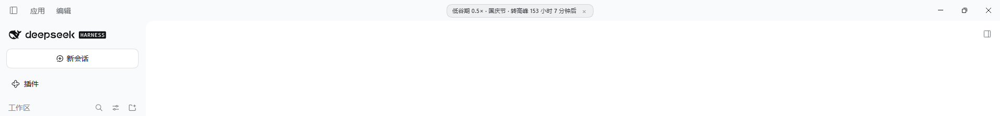
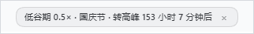

# DeepSeek 峰谷时段角标（DeepSeek Harness 桌面版插件）

[English](#english) · 简体中文

> **本插件适配 DeepSeek Harness 桌面版。** 角标默认贴在**视口顶边居中**（`top: 4px`，见 `applyDefaultPosition()`），在桌面版里这个落点正好是应用自绘的窗口标题栏 —— 也就是下图实拍的位置。Host 侧没有桌面专有依赖，但落位是按桌面版窗口设计的：浏览器版（DSH Web）没有这条标题栏，角标会贴到页面本身的最顶端，**未做适配与验证**。

在 DeepSeek Harness **桌面版**窗口的**标题栏居中**常驻一个小角标（可拖动到任意位置），显示当前是否处于 DeepSeek API 的**错峰（低谷）优惠时段**、以及距下一次切换的倒计时。



<sub>角标位于窗口标题栏正中（低谷期实拍）。放大看：</sub>



- **高峰**：角标切成**深红底 + 近白文字**
- **低谷**：低调中性底色，安静提示

**本插件不改动任何背景色或主题令牌**，界面配色始终完全由主题决定；低谷态按主题分浅灰/深灰两套，高峰态只在浅色主题转为深红。

判定口径来自 [DeepSeek API 官方定价页](https://api-docs.deepseek.com/quick_start/pricing)：

- 高峰 = **UTC 01:00–04:00 与 06:00–10:00**，**仅周一至周五**，**中国法定节假日除外**
- 其余时间（含周末与法定节假日全天）为低谷，价格为高峰的 **0.5×**
- 折合北京时间：工作日 **09:00–12:00、14:00–18:00** 为高峰

## 角标文案

| 时段 | 文案示例 |
|---|---|
| 低谷 | `低谷期 0.5× · 国庆节 · 转高峰 132 小时 0 分钟后` |
| 高峰 | `高峰期 1× · 转低谷 2 小时 30 分钟后` |

节假日当天会带上节日名。判定每 30 秒复算一次，跨时段边界最多延迟约 30 秒变色。

## 关闭角标

角标右侧有一个 **×** 按钮，点一下即可关闭。

- 关闭状态记在 `sessionStorage`，**本次运行内**不再出现；重开应用后会重新出现 —— 避免一次误关就永久错过高峰提醒。
- 想立刻恢复：控制台执行 `__dshOffpeak.showBadge()`。

## 拖动角标

**默认位置：标题栏水平居中、贴窗口顶边**（`top: 4px`）。按住角标的任意位置即可拖到别处 —— 例如右上角三件套那一排。

- 整条角标都是拖拽手柄（关闭按钮那一小块除外，那里留给点击）。
- 光标保持普通箭头，不变成手型。
- **拖过之后就不再自动居中**：位置存 `localStorage`，重开应用后保持。
- 没拖过时，窗口宽度变化会跟着重新居中；拖过后只在超界时收敛回可见范围。
- 想回到标题栏居中：控制台执行 `__dshOffpeak.resetPosition()`。

> 取舍说明：整条可拖意味着角标占据的那一小块矩形会接收鼠标事件。它默认停在标题栏正中，
> 那里通常没有可点控件；若与别的标题栏元素重叠，拖开即可。

## 安装

1. 把本仓库克隆或下载到本地任意目录
2. 打开 **DeepSeek Harness 桌面版**，进入**插件面板**（侧边栏 Plugins）
3. 点「**添加插件**」
4. 在「包名或地址」里填入本目录的绝对路径，例如：

   ```text
   <你存放本仓库的绝对路径>\dsh-offpeak-alert
   ```

5. 确认安装，并在插件列表里把它**启用**

> 插件以「本地目录」方式安装（profile 里登记为 `link:` 依赖），因此本仓库的改动会直接生效 —— 想升级就 `git pull` 后重载插件。

## 控制台查询

角标本身可拖动（按住任意位置）、可关闭（右侧 ×）；更详细的信息用开发者工具 Console：

```js
__dshOffpeak.status()      // { status:'peak'|'off-peak', holidayName, reason, beijing, ... }
__dshOffpeak.nextSwitch()  // { at: <时间戳>, peak: <切换后的状态> }
__dshOffpeak.showBadge()   // 恢复被 × 关掉的角标
```

## 组件

| 文件 | 作用 |
|---|---|
| `package.json` | 包清单：`dsh.bundle.patch` 指向补丁，`dsh.client` 声明浏览器端产物 |
| `cordis.patch.yml` | 往当前 profile 插入插件行 |
| `index.js` | Host 侧，只导出 `apply`（效果全在浏览器端） |
| `client.js` | 浏览器端：峰谷判定 + 标题栏居中的可拖动角标 |
| `icon.svg` | 插件卡片图标：石墨圆角块，上浅下深对半切开（峰／谷），中间是中性单线 **1/2**，斜杠用 DeepSeek 蓝 `#4d6bfe`。**刻意不用红色、不用叹号** —— 插件列表里的红色叹号会被读成「这个插件报错了」 |

## 改配色

配色写在 `client.js` 的 `BADGE_CSS` 里，**故意使用字面色值而不用主题令牌**。低谷态按主题分两套，高峰态只在浅色主题转深红：

| 选择器 | 用途 | 当前值 |
|---|---|---|
| `[data-dsh-offpeak-badge]` | 浅色主题 · 低谷 | 底 `#edeef0f2`、字 `#1f2126`、描边 `#0000001f` |
| `body[data-ds-dark-theme] [data-dsh-offpeak-badge]` | 深色主题 · 低谷 | 底 `#1c1c1feb`、字 `#f2f2f4`、描边 `#ffffff2e` |
| `[data-dsh-offpeak-badge][data-state="peak"]` | 浅色主题 · 高峰 | 底 `#8f1420`、字 `#ffe9ea`、红色投影 |
| `body[data-ds-dark-theme] …[data-state="peak"]` | 深色主题 · 高峰 | 保持深灰底（覆盖上面的红），投影换中性黑 |
| `.dsh-offpeak-close:hover` | 关闭按钮悬浮 | 浅色 `#00000018` / 深色 `#ffffff2b` / 高峰 `#ffffff33` |

写法约定（改动前先读）：

1. **深浅两套都按 `body[data-ds-dark-theme]` 分支**，不要用 `prefers-color-scheme` —— DSH 的主题切换靠这个属性，媒体查询会跟着系统走、而不是跟着应用内设置走。
2. **高峰规则先写通用形态、深色随后显式覆盖**，不用 `:not()`。语法越简单，级联越不容易被误判。
3. 每套配色都写完整的简写属性（`border` 而不只是 `border-color`），避免与基础规则的简写相互重置。
4. `background` 是简写属性：hover 规则必须声明在基础规则之后，否则底色会被基础规则的 `background: transparent` 重置。

改完需要重新加载插件才生效（替换已安装的包要重启 DSH）。

## 规则会过期吗？（重要）

**本插件不联网，峰谷时段是硬编码的。官网若调整规则，插件不会自动跟上** —— 它只会按你的核对周期提醒你。

三处硬编码内容：

| 内容 | 位置 | 何时会变 |
|---|---|---|
| 峰谷时段（UTC 01:00-04:00 / 06:00-10:00，仅工作日，法定节假日除外） | `statusAt()` 里的分钟数判断 | 官网调规则时 |
| 中国法定节假日（2026 全年，含调休连休） | `OFFICIAL_HOLIDAYS` | 每年国务院发通知 |
| 2027+ 节假日估算值 | `LUNAR_FALLBACK` | 同上 |

内置的过期提醒（纯本地、不联网）在两种情况下触发：

1. **距 `SCHEDULE_VERIFIED_ON` 超过 `SCHEDULE_MAX_AGE_DAYS`（默认 90 天）** —— 提示你重新核对官网
2. **当前年份没有 `OFFICIAL_HOLIDAYS` 精确数据** —— 表明当年的节假日是农历估算值

触发时：角标末尾出现 **`· 规则待核`**、右上内侧点一个小黄点（`data-stale`），并在 Console（每会话一次）打印告警。`__dshOffpeak.status()` 的返回里也带 `scheduleNotes` 数组和 `scheduleVerifiedOn`。

**核对流程**（官网改规则时）：

1. 打开 <https://api-docs.deepseek.com/quick_start/pricing>，确认高峰时段
2. 若变了，改 `statusAt()` 里这两处分钟判断：

   ```js
   peak = (minutes >= 9 * 60 && minutes < 12 * 60) || (minutes >= 14 * 60 && minutes < 18 * 60);
   ```

   （以及周末判断 `bj.dow === 0 || bj.dow === 6`、节假日判断是否仍适用）
3. 把 `SCHEDULE_VERIFIED_ON` 改成核对当天日期，小黄点即消失

## 更新节假日

`client.js` 顶部的 `OFFICIAL_HOLIDAYS` 内置 2026 年安排（国办发明电〔2025〕7 号）。官方发布新年度通知后，按同样格式补一条 `2027: [[...]]` 即可；未内置的年份按农历节日估算（`LUNAR_FALLBACK`），精度略低。

## 已知边界

- **面向 DeepSeek Harness 桌面版**：默认落位是「视口顶边居中」，依赖桌面版把窗口标题栏画在文档内。浏览器版（DSH Web）没有这条标题栏，角标会落在页面顶端，未做适配与验证。
- 只影响主窗口文档；终端、文档预览等独立 iframe 内不显示角标。
- 角标 `position: fixed` 脱离文档流，不占位、不挤压宿主布局；文案单行不换行，只有极窄窗口才会以省略号收尾。
- 不改主题、不改背景、不写 `localStorage`（位置与关闭状态分别记 `localStorage`/`sessionStorage`）、不注册全局事件，卸载即彻底还原。
- 角标除拖动/关闭所需的最小命中区域外不做交互；它占据的那一小块矩形会接收鼠标事件，默认位置（标题栏居中）通常没有可点控件，如与其它元素重叠可拖开。

## 许可

[MIT](LICENSE)。

## 关于本项目

本项目在 AI 编程助手（DeepSeek Harness 及其内置 agent）协助下完成，包括规则实现、配色方案与自动化自检脚本。
判定规则以 [DeepSeek API 官方定价页](https://api-docs.deepseek.com/quick_start/pricing) 为准，本插件不联网、不保证与官网实时一致 —— 请留意角标上的「规则待核」提示。

---

<a id="english"></a>
## English

A badge for the **DeepSeek Harness desktop app** ([quick start](https://deepseek-harness.github.io/deepseek-harness/en/guide/quickstart)): it sits in the window title bar (see the screenshot at the top) and shows whether the DeepSeek API is currently in its **off-peak (discounted) window**, plus a countdown to the next switch.

**Desktop app only.** The badge's default spot is the top-centre of the viewport, which is where the desktop app draws its window title bar. The browser build (DSH Web) has no such title bar, so the badge would land at the very top of the page — neither supported nor tested there. The Host side has no desktop-specific dependency.

- **Peak** → the badge turns deep red. **Off-peak** → a quiet neutral badge.
- Sits centered in the title bar and can be **dragged anywhere** (position is remembered).
- **Changes no background colors and no theme tokens** — the UI palette stays entirely up to the theme.
- No dependencies, no network access, no build step.

Rule source: [DeepSeek API pricing](https://api-docs.deepseek.com/quick_start/pricing) — peak hours are **01:00–04:00 and 06:00–10:00 UTC, Monday–Friday, excluding Chinese public holidays**; everything else is off-peak at half the peak price.

Install: clone this repository, then in the DSH Plugins panel choose *Add plugin* and give the **absolute path** to this directory. The plugin is registered as a local `link:` dependency, so `git pull` + reload picks up updates.

**Caveat:** the schedule is hard-coded and this plugin never phones home. If DeepSeek changes its peak hours, the badge will be confidently wrong. The badge therefore marks itself `规则待核` (needs review) once `SCHEDULE_VERIFIED_ON` is older than 90 days, or when the current year's public-holiday list is only an estimate. See the Chinese section above for the update procedure.

Licensed under [MIT](LICENSE).

